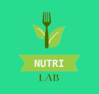
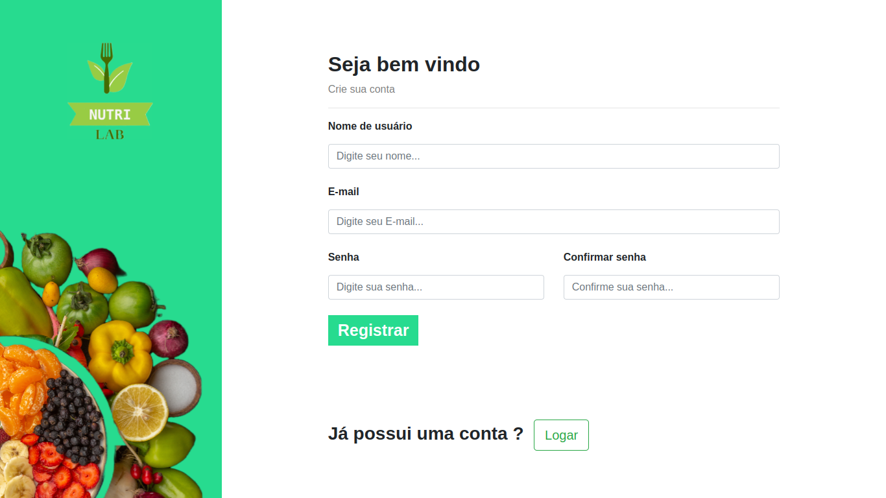
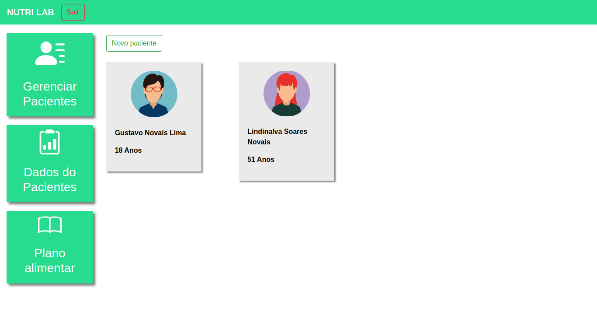
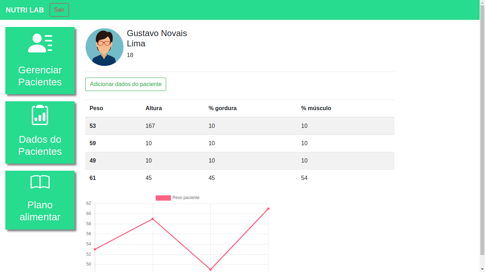
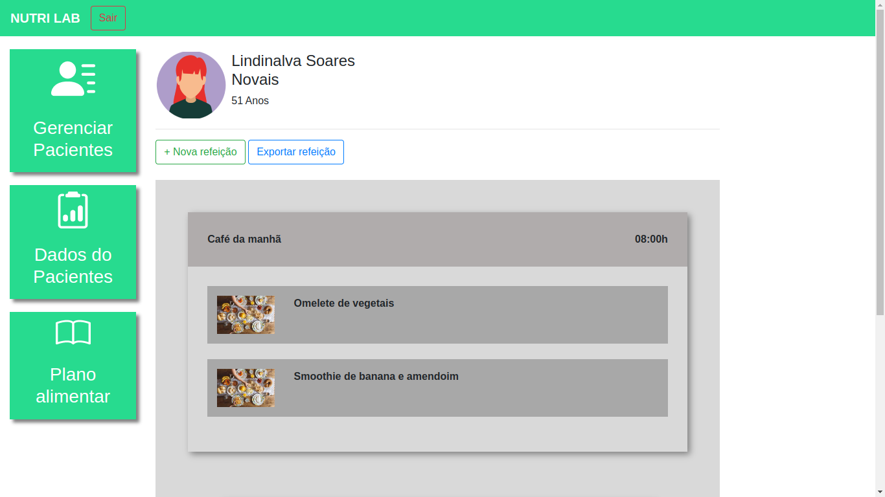

<div align="center" id="top"> 
  

</div>

<div align="center"> 
  <h1 align="center">NutriLab</h1>

</div>

<p align="center">
  

  

  

  

  <!--  -->

  <!--  -->

  <!--  -->
</p>

<hr> -->

<p align="center">
  <a href="#dart-sobre">Sobre</a> &#xa0; | &#xa0; 
  <a href="#sparkles-funcionalidades">Funcionalidades</a> &#xa0; | &#xa0;
  <a href="#rocket-tecnologias">Tecnologias</a> &#xa0; | &#xa0;
  <a href="#white_check_mark-pré-requisitos">Pré requisitos</a> &#xa0; | &#xa0;
  <a href="#checkered_flag-começando">Começando</a> &#xa0; | &#xa0;
  <a href="https://github.com/gustavonovais1" target="_blank">Autor</a>
</p>

<p align="center">
  
  
  
  

</p>

## 🎯 Sobre

Um sistema desenvolvido pensando no gerenciamento de pacientes para profissionais nutricionistas,

## ✨ Funcionalidades

✔️ Login/Logout;\
✔️ Cadastro/exclusão de pacientes;\
✔️ Ária para cadastro de dados dos pacientes com gráfico de evolusão do seu peso:\
✔️ Tela para cadastro de plano alimentar para o paciente;


## 🚀 Tecnologias

As seguintes ferramentas foram usadas na construção do projeto:

- [Python](https://www.python.org/)
- [Django](https://www.djangoproject.com/)
- [HTML](https://developer.mozilla.org/pt-BR/docs/Web/HTML)
- [CSS](https://developer.mozilla.org/en-US/docs/Web/CSS)
- [Bootstrap](https://getbootstrap.com/)


## ✅ Pré requisitos

Antes de começar 🏁, você precisa ter o [Python](https://www.python.org/downloads/) instalado em sua maquina.

## 🏁 Começando

1 - Primeiro clone o repositório e entre na pasta do projeto.

```bash
# Clone este repositório
$ https://github.com/gustavonovais1/NutriLab.git

# Entre na pasta
$ cd NutriLab
```

2 - Segundo inicie um ambiente virtual

```bash
# Criar
  # Linux
    $ python3 -m venv venv
  # Windows
    $ python -m venv venv

#Ativar
  # Linux
    $ source venv/bin/activate
  # Windows
    $ venv/Scripts/Activate

# Caso algum comando retorne um erro de permissão execute o código e tente novamente:

  $ Set-ExecutionPolicy -Scope CurrentUser -ExecutionPolicy RemoteSigned
```

3 - Instale as dependências

```bash
# Instale as dependências

# Linux
$ pip3 install -r requirements.txt
# Windows
$ pip install -r requirements.txt
```

4 - Faça as migrações.

```bash
# Linux
$ python3 manage.py migrate
# Windows
$ python manage.py migrate

```

5 - Crie um super usuário

```bash
$ python3 .\manage.py createsuperuser
$ python .\manage.py createsuperuser
```

6 - Inicie a aplicação

```bash
# Para iniciar o projeto
# Linux
$ python3 manage.py runserver
# Windows
$ python manage.py runserver

# O app vai inicializar em <http://127.0.0.1:8000/>

# Para iniciar o projeto em uma porta especifica
$ python manage.py runserver <porta>

# O app vai inicializar em <http://127.0.0.1:<porta>/>

```
<a href="#top">Voltar para o topo</a>